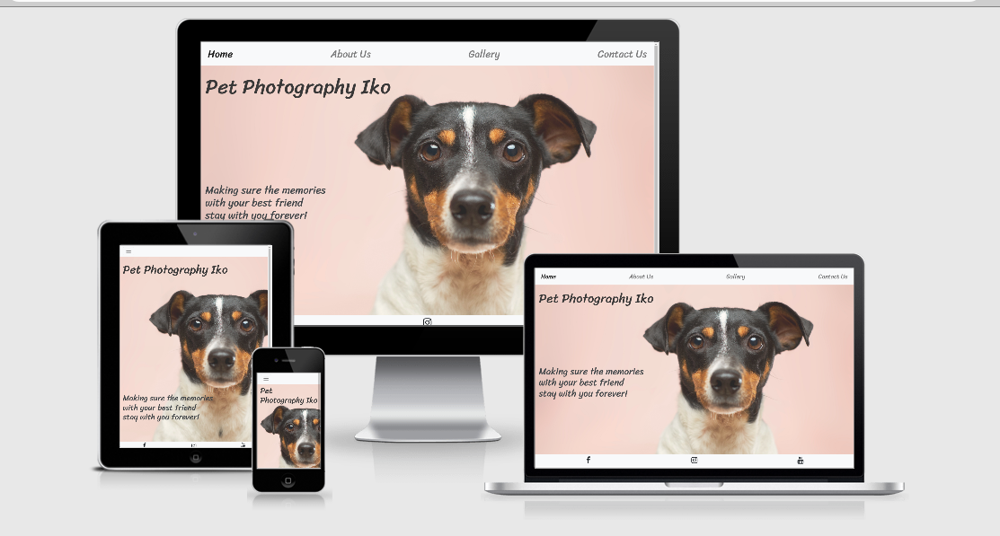

<h1>Pet Photography Iko</h1>

[View the live project here.](https://natalijabujevic0708.github.io/PetPhotographyIko/)

This is the website for Pet Photography Iko. It is designed to be responsive and accessible on a range of devices, making it easy to navigate for potential customers.

<h2 align="center"></h2>
<h2>User Experience (UX)</h2>

-   ### User stories

    -   #### First Time Visitor Goals

        1. As a First Time Visitor, I want to easily understand the main purpose of the site and learn more about the service the company offers.
        2. As a First Time Visitor, I want to be able to easily navigate throughout the site to find content.
        3. As a First Time Visitor, I want to see their portfolio and what kind of service the company offers.
        4. As a First Time Visitor, I want to see their social media platforms.

    -   #### Returning Visitor Goals

        1. As a Returning Visitor, I want to find the best way to get in contact with the service.
        

    -   #### Frequent User Goals
        1. As a Frequent User, I want to check to see if there are any newly added photos in the gallery or offers.
        
### Design
#### Colour Scheme
- The main colours used are white, light gray and dark gray.
#### Typography
 - The Sriracha (cursive) font is the main font used throughout the whole website with Sans Serif as the fallback font in case for any reason the font isn't being imported into the site correctly. 
#### Imagery
- Imagery is important. The large, background hero image is designed to be striking and catch the user's attention. It also has a modern, energetic aesthetic.
### Wireframes
- Wireframe - [View](https://wireframe.cc/pro/pp/dd6625b30356672)

## Features

-   Responsive on all device sizes

-   Interactive elements

## Technologies Used

### Languages Used

-   [HTML5](https://en.wikipedia.org/wiki/HTML5)
-   [CSS3](https://en.wikipedia.org/wiki/Cascading_Style_Sheets)

### Frameworks, Libraries & Programs Used

1. [Bootstrap 4.4.1:](https://getbootstrap.com/docs/4.4/getting-started/introduction/)
    - Bootstrap was used to assist with the responsiveness and styling of the website.
1. [Hover.css:](https://ianlunn.github.io/Hover/)
    - Hover.css was used on the submit button on the form at the Contact Us page.
1. [Google Fonts:](https://fonts.google.com/)
    - Google fonts were used to import the 'Sriracha' font into the style.css file which is used on all pages throughout the project.
1. [Font Awesome:](https://fontawesome.com/)
    - Font Awesome was used on About Us page to add icons for aesthetic and UX purposes.
1. [Git](https://git-scm.com/)
    - Git was used for version control by utilizing the Gitpod terminal to commit to Git and Push to GitHub.
1. [GitHub:](https://github.com/)
    - GitHub is used to store the projects code after being pushed from Git.

## Testing

The W3C Markup Validator and W3C CSS Validator Services were used to validate every page of the project to ensure there were no syntax errors in the project.

-   [W3C Markup Validator](https://validator.w3.org/) - [Result](https://validator.w3.org/nu/?showsource=yes&doc=https%3A%2F%2Fnatalijabujevic0708.github.io%2FPetPhotographyIko%2F)
-   [W3C CSS Validator](https://jigsaw.w3.org/css-validator/) - [Results](https://jigsaw.w3.org/css-validator/validator?uri=https%3A%2F%2Fnatalijabujevic0708.github.io%2FPetPhotographyIko%2F&profile=css3svg&usermedium=all&warning=1&vextwarning=&lang=en)

### Testing User Stories from User Experience (UX) Section

-   #### First Time Visitor Goals

    1. As a First Time Visitor, I want to easily understand the main purpose of the site and learn more about the service the company offers.
        1. Upon entering the site, users are automatically greeted with a navigation bar to go to the page of their choice. 
        2. Underneath there is a Image with Text about the purpose of the service.
        
    2. As a First Time Visitor, I want to be able to easily navigate throughout the site to find content.
        1. At the top of each page there is a clean navigation bar, each link describes what the page they will end up at clearly.

    3. As a First Time Visitor, I want to see their portfolio and what kind of service the company offers.
        1. There is a gallery offering a portfolio of the pictures the service makes.

    4. As a First Time Visitor, I want to see their social media platforms.
        1. There are links to the social media platforms in the footer of every page.
        2.  Whichever link they click, it will be open up in a new tab to ensure the user can easily get back to the website.

-   #### Returning Visitor Goals

    1. As a Returning Visitor, I want to find the best way to get in contact with the service.
        1. The navigation bar clearly highlights the "Contact Us" Page.
        2. Here they can fill out the form on the page.
       

-   #### Frequent User Goals

    1. As a Frequent User, I want to check to see if there are any newly added photos in the gallery or offers.
        1. In the Gallery page there are badges that mark new photos added so a Frequent User can see new products.

### Further Testing

-   The website was viewed on a variety of devices such as Desktop, Laptop, iPhone, Samsung and Motorola.
-   A large amount of testing was done to ensure that all pages were linking correctly.
-   Friends and family members were asked to review the site and documentation to point out any bugs and/or user experience issues.

### Known Bugs

-   On some mobile devices the background image on Home page doesn't load;

## Deployment

### GitHub Pages
- The project was deployed to GitHub Pages using the following steps:

1. Loged in to GitHub and located the [GitHub Repository](https://github.com/natalijabujevic0708/PetPhotographyIko)
2. At the top of the Repository, located the "Settings" Button on the menu.
3. Scrolled down the Settings page until I located the "GitHub Pages" Section.
4. Under "Source", clicked the dropdown called "None" and select "Master Branch".
5. The page automatically refreshed.
6. Scrolled back down through the page to locate the now published site [link](https://natalijabujevic0708.github.io/PetPhotographyIko/) in the "GitHub Pages" section.

- The developer had 2 github repositories and that is the reason there are 2 contributors - [natalijabujevic](https://github.com/natalijabujevic) and [natalijabujevic0708](https://github.com/natalijabujevic0708)

## Credits

### Code

-   [Bootstrap4](https://getbootstrap.com/docs/4.4/getting-started/introduction/): Bootstrap Library used throughout the project: Bootstrap Grid System, Nav Bar, Footer, Gallery Layout, Badges, Form Layout.

### Content

-   All content was written by the developer.
-   Template for the README.md found on https://github.com/Code-Institute-Solutions/SampleREADME

### Media

-   All Images were taken from freely-usable source Unsplash and Pexels.
    - HomePhoto.jpg - Photo by Victor Grabarczyk on Unsplash.
    - AboutUsPhoto.jpg - Photo by Justin Veenema on Unsplash.
    - ContactUsPhoto.jpg - Photo by Joe Caione on Unsplash.
    - gallery1.jpg - Photo by Matheus Bertelli from Pexels
    - gallery2.jpg - Photo by Levi Saunders on Unsplash.
    - gallery3.jpg - Photo by Xan Griffin on Unsplash.
    - gallery4.jpg - Photo by Athena from Pexels.
    - gallery5.jpg - Photo by Daria Shevtsova from Pexels.
    - gallery6.jpg - Photo by La Miko from Pexels.
    - gallery7.jpg - Photo by Jennifer Murray from Pexels.
    - gallery8.jpg - Photo by Mael BALLAND on Unsplash.
    - gallery9.jpg - Photo by Hristina Šatalova on Unsplash.

### Acknowledgements

-   My Mentor for continuous helpful feedback.

